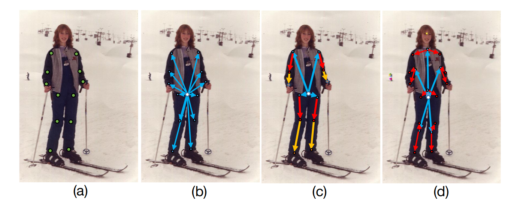
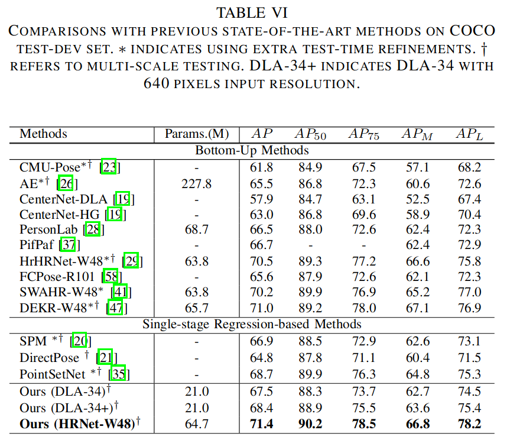
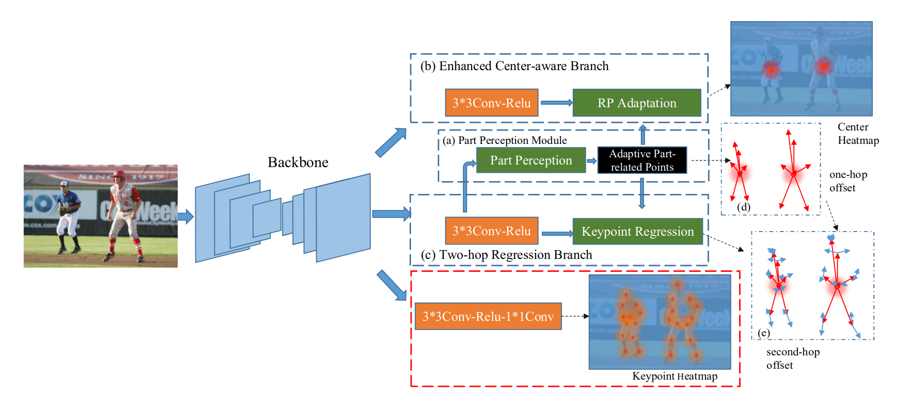
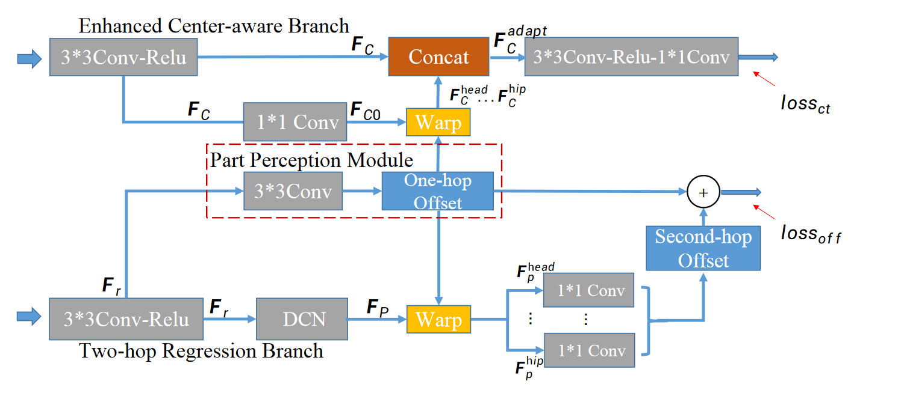

# AdaptivePose: Human Parts as Adaptive Points(AAAI 2022)
# AdaptivePose++: A Powerful Single-Stage Network for Multi-Person Pose Regression
## adaptive point 自适应点

+ (a) 传统的表示方法：top-down&bottom-up
+ (b) CenterNet提出的center-to-joint身体表示
+ (c) SPM提出的分等级身体表示法
+ (d) adaptIve points
对比结果(网络模型参数量都不相同)：

  

1) 提出的点集表示在自适应部位相关点处引入了额外的特征，与有限的中心表示相比，这些特征能够编码更有信息的特征，用于灵活的姿态。The proposed point set representation introduces additional features at adaptive part related points, which are able to encode more informative features for flexible pose compared with limited center representation. 
2) 自适应部分相关点作为中继节点，可以在单次前向传递中更有效地建模人类实例与相应关键点之间的关联。The adaptive part related points serves as relay nodes can more effectively model the associations between human instance and corresponding keypoints in a single-forward pass.

## Three Parts
+ The **Part Perception Module** to regress seven adaptive human-part related points for perceiving corresponding seven human parts.
+ In contrast to using the limited feature with fixed receptive field to predict the human center, the **Enhanced Centeraware Branch** conducts the receptive field adaptation by aggregating the features of adaptive human-part related points to perceive the center of various pose more precisely.
+ The **Two-hop Regression Branch** together with the **Skeleton-Aware Regression Loss** for regressing keypoints. The adaptive human-part related points act as one-hop nodes to factorize the center-to-joint offsets dynamically.

## Five Aspects from AdaptivePose to AdaptivePose++
+ more details for clearer and more comprehensive presentation
+ improve the regression loss and add an additional loss term to learn the bone connections of inner parts and cross parts, which is helpful for crowd scene
+ more experiments
+ sota on Crowdpose
+ extent the method to 3D multi-person pose estimation task

## Contributions
+ We propose to represent human parts as points thus the human body can be represented via an adaptive point set including center and several human-part related points. To our best knowledge, we are the first to present a finegained and adaptive body representation to sufficiently encode the pose information and effectively build up the relation between the human instance and keypoints in a single-forward pass. 
+ Based on the novel representation, we exploit a compact single-stage differentiable network, termed as AdaptivePose. Specifically, we introduce a novel Part Perception Module to perceive the human parts by regressing seven human-part related points. By manipulating human-part related points, we further propose the Enhanced Centeraware Branch to more precisely perceive the human center and the Two-hop Regression Branch together with the Skeleton-Aware Regression Loss to precisely regress the keypoints.
+ Our method significantly simplifies the pipeline of existing multi-person pose estimation methods. The effectiveness is demonstrated on both 2D, 3D pose estimation benchmarks. We achieves the best speed-accuracy tradeoffs without complex refinements and post-processes. Furthermore, extended experiments on CrowdPose and MuPoTS-3D clearly verify the generalizability on crowd and 3D scenes.

## Body Representation
$C_{inst} → \{P_{head}, P_{sho}, P_{la}, P_{ra}, P_{hip}, P_{ll}, P_{rl}\} → \bf{Joint}$
### Features
+ points are predicted by center feature dynamically and **not pre-defined locations**
+ instead of only using the root feature to encode the whole pose information, the features of adaptive points are also leveraged to encode keypoint information of different parts more sufficiently
+ built upon the **pixel-wise** keypoint regression framework
+ **differentialbe**, without any non-differentiable process

## FrameWork

  
  

