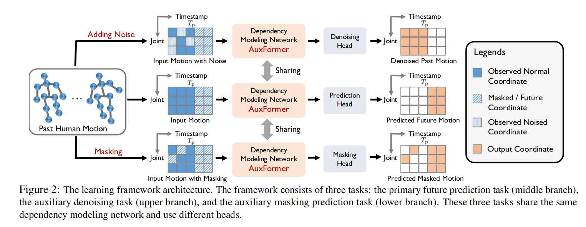
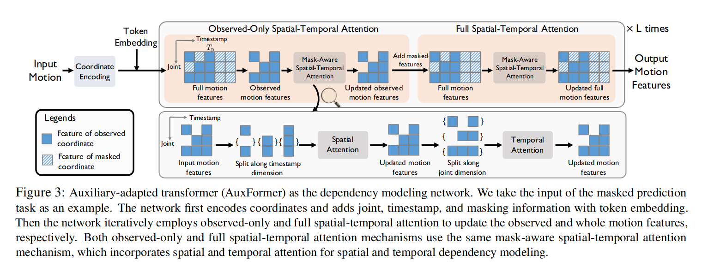
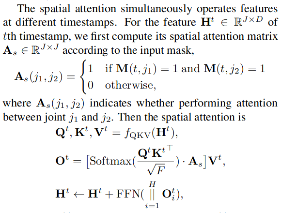
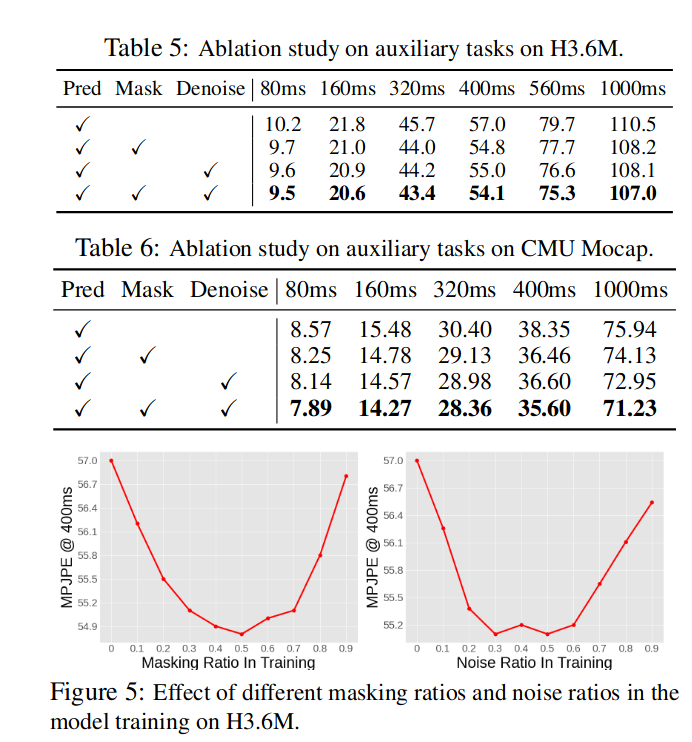
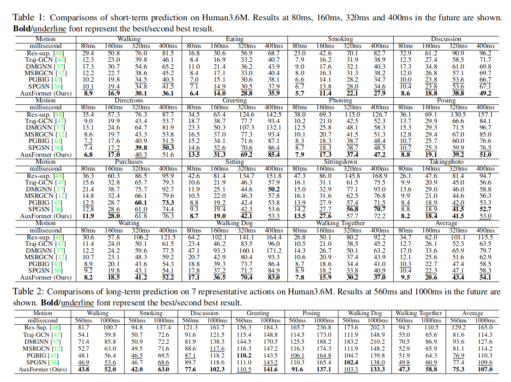

# Auxiliary Tasks Benefit 3D Skeleton-based Human Motion Prediction(ICCV 2023)
## Institution
1. Shanghai Jiao Tong University
2. National University of Singapore
3. Shanghai AI Laboratory
## Abstract
In our auxiliary tasks, partial body joints’ coordinates are corrupted by either masking or adding noise and the goal is to **recover corrupted coordinates depending on the rest coordinates**. To work with auxiliary tasks, we propose a novel auxiliary-adapted transformer, which can handle incomplete, corrupted motion data and achieve coordinate recovery via capturing spatial-temporal dependencies.
在我们的辅助任务中，部分身体关节的坐标因掩蔽或添加噪声而损坏，目标是根据其余坐标恢复损坏的坐标。为了处理辅助任务，我们提出了一种新颖的辅助自适应变换器，它可以处理不完整、损坏的运动数据，并通过捕获时空依赖性来实现坐标恢复。

Can we **enhance spatial-temporal dependency modeling** from other perspectives?
+ Propose a new auxiliary learning framework for human motion prediction to jointly learn the prediction task with two auxiliary tasks: **denoising and masking prediction**. Through auxiliary tasks, the model network is **forced to learn more comprehensive spatial-temporal dependencies**.

Primary Task: Motion Prediction
Auxiliary Task: Masked Motion Prediction, Denoise Motion

## Framework
### Overview

**网络整体特点**
+ 通过Masked Prediction与Denoise两个辅助任务**增强了网络对时空依赖建模的能力**
	文中表明，与 *Towards accurate 3d human motion prediction from incomplete observations(CVPR 2021)* 对比，设计的两个辅助任务，只是训练时增强了网络的学习能力，在推理时并不会使用辅助任务，没有增加额外的步骤

+ 多任务网络，各个任务的网络参数共享
	由于网络的主要参数量在特征学习层，而特征学习层的参数是共享的，辅助任务的Regress Head 是非常简单的所以网络整体上不会增加太多的参数量。

### Structure Details

**Coordinate encoding:** 简单的Linear 对坐标进行编码
**Token embedding:** 
关节位置    Joint Position Embedding  $W_{J,j} \in R^{F}$ 
时间戳      Timestamp Embedding     $W_{T,t} \in R^F$
掩码        Masked Token Embedding  $W_M \in R^F$

$$
h^t_j=
\begin{cases}
e_j^t + W_{T,t} + W_{J,j} \qquad \text{if M(t,j)=1,}   \\
W_M + W_{T,t} + W_{J,j}  \quad \text{if M(t,j)=0.}
\end{cases}
$$

**Mask-aware spatial-temporal attention:**
As the spatial relationship between joints and the temporal relation between timestamps have different patterns, we use spatial and temporal attention mechanisms to model the spatial and temporal dependencies separately.
Spatial attention considers features of the same timestamp, while temporal attention considers features of the same joint.
由于关节之间的空间关系和时间戳之间的时间关系具有不同的模式，我们使用空间和时间注意力机制分别对空间和时间依赖关系进行建模。空间注意力考虑相同时间戳的特征，而时间注意力考虑相同关节的特征。

	 

### Auxiliary-Adapted Transformer
+ instead of solely using full spatial-temporal attention, we **additionally incorporate observed-only spatialtemporal attention**. The intuition is modeling spatial-temporal dependencies inner observed coordinates provides more correlations to improve the ability to infer spatialtemporal dependencies between observed and masked coordinates; 
+ instead of performing observed-only and full spatial-temporal attention separately for L times, we employ an **iterative** approach because interaction with masked coordinate features can also enhance observed features.

**Effect of masking & noise ratios.** 
i) setting masking and noising ratios that are either too low or too high results in suboptimal performance, as the auxiliary tasks become either too easy or too difficult, rendering them unsuitable for model learning; 
ii) a moderate masking and noising ratio yielded the best results, with **an appropriate masking ratio range of 0.3 to 0.7 and an appropriate noising ratio range of 0.2 to 0.6.**

	 

## Results

## Question
1. 辅助任务 or 输入增强
