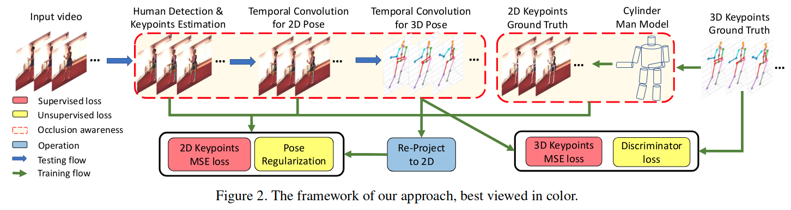
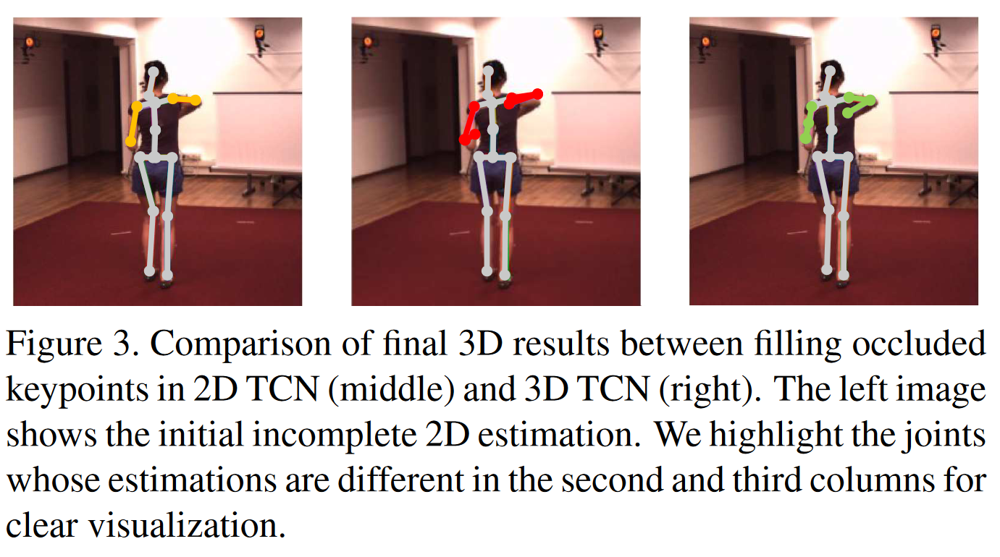
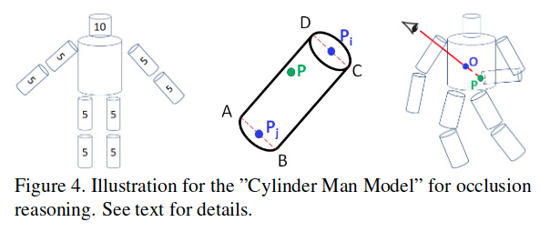
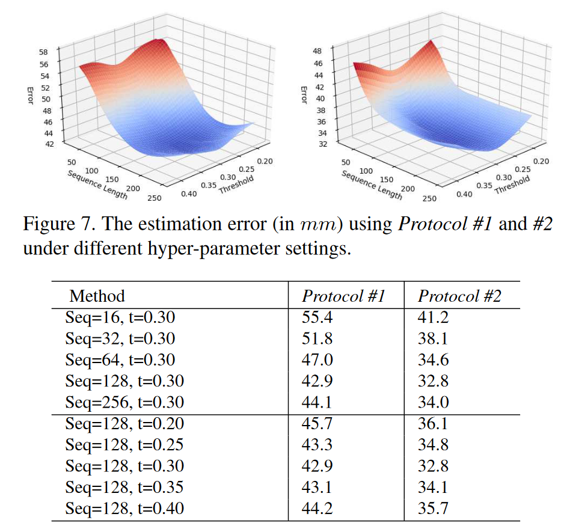
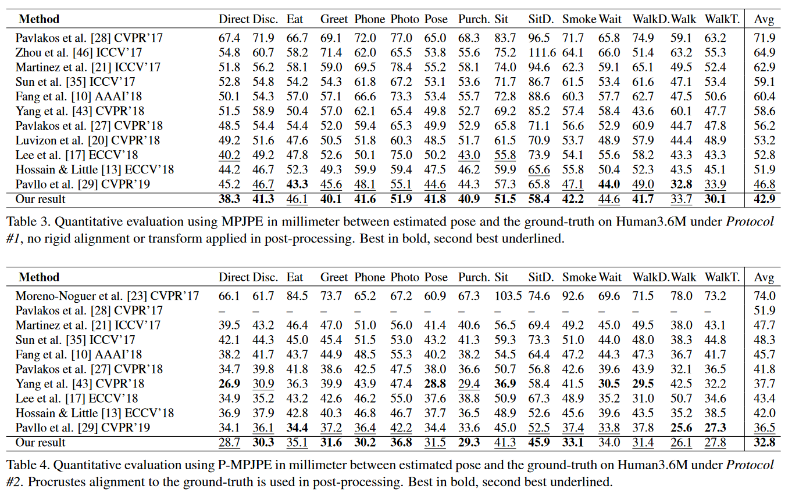

# Occlusion-Aware Networks for 3D Human Pose Estimation in Video(ICCV 2019)

## 特点
+ 筛选过滤掉不可信点，将剩余的结果输入到 TCN 模型中生成完整的 3D 关键点
+ 圆柱体模型进行一致性约束，以及训练时数据的数据增强
## Abstract
+ employing **estimated 2 D confidence heatmaps of keypoints** and an **optical-flow consistency constraint** -> filter out the unreliable estimations of occluded keypoints. 通过 2D 热图和光溜一致性约束过滤掉不可信点和被遮挡点。
+ When occlusion occurs, we have incomplete 2D keypoints and feed them to our 2D and 3D temporal convolutional networks (2D and 3D TCNs) that enforce temporal smoothness to produce a complete 3D pose. 如果存在遮挡，将过滤后的二维关键点输入到 2D 与 3D TCN 中生成完整的 3D 关键点。
    *-> By using incomplete 2D keypoints, instead of complete but incorrect ones, our networks are less affected by the error-prone estimations of occluded keypoints.*
+ introduce a “Cylinder Man Model” to approximate the occupation of body parts in 3D space 使用圆柱体模型来进行数据增强，以及正则约束。 
    *-> By projecting the model onto a 2D plane in different viewing angles, we obtain and label the occluded keypoints, providing us plenty of training data. In addition, we use this model to create a pose regularization constraint, preferring the 2D estimations of unreliable keypoints to be occluded.*

## Contribution
+ We introduce a 3D pose estimation framework with explicit occlusion handling. 
+ We propose a novel “Cylinder Man Model” for automatic data augmentation of paired 3D pose and occluded 2D pose, and for pose regularization of occluded keypoints. 
+ We introduce a fully integrated framework of 2D pose and 3D pose estimations that can be trained end-to-end and in a semi-supervised way.

## Framework

### First Network (Human Detection & Keypoints Estimation)
+ first network outputs a set of heatmaps, expressed as $\tilde{M_i}$, witch train with loss 第一个网络输出为一系列热图 $\tilde{M_i}$，损失函数为:

$$
L^S_{2D}=\sum^K_{i=1}{\|M_{i}-\tilde{M_{i}}\|^2_{2}}
$$

+ where $M_i$ is the ground-truth heatmap for keypoint i, and is defined as all zero for occluded keypoints and a single peak with Gaussian smoothness for non-occluded ones as Hourglass Net.
	$M_i$ 是关键点热图的 GT，关键点被遮挡时定义为零，不被遮挡时定义为第 i 个关键点的热图对应峰值点。
+ For each heatmap $\tilde{M_{i}}$, we choose the peak response point  $\tilde{p_i}$ with a confidence score of $C_{i}$ as a candidate for the $i$ th keypoint. To further improve the occlusion estimation, we apply optical flow , and record the flow vector as $\tilde{o_{i}}$ .  First network also processes the next frame, and the location difference of keypoint i in the neighboring frames is defined as $\tilde{d_{i}}$ .
	针对每一个热图，通过每一个热图的峰值相应点的置信度来作为关键点的候选点。为了提高对遮挡点估计的准确性，收集关键点 i 对应的光流向量以及计算两帧之间估计的关键点的向量，在置信度的计算中加入两者差值，以增强网络对遮挡的理解。
+ 第 i 个关键点的置信度 $C^*_{i}$ 如下，当 $C^*_{i}$ 低于阈值 b 时，被认定为被遮挡点。

$$
C^*_i=C_{i}exp(-\frac{{\|\vec{o_i}-\vec{d_i}\|^2_{2}}}{2\sigma^2})
$$

### Second Network (2D TCN)
+ To exploit temporal smoothness, we concatenate the coordinates of all 2 D keypoints to form a 2 K long vector,  ̃ X, and feed all such vectors in the temporal window to a 2 D dilated temporal convolutional network (2 D TCN), f (·).
	利用时间的平滑性，进行 2 D 关键点的预测，实际上是在利用时间信息优化第一个网络的预测结果。与 videopose 3 D 不同，网络只输入非遮挡点，输出也为非遮挡点，而不是完整的关键点序列，通过阈值 b 筛选出遮挡点。

+ loss：

$$
L^T_{2D}=\|C^T_{b} \big( f(C^T_{b}\tilde{X})-X \big)\|^2_{2}
$$

+ 在本文的处理中，不会在 2 DTCN 中补全被遮挡点。通过实验发现在 3 DTCN 补全姿态序列的效果比在 2 DTCN 补全的效果更好。原因是 3 D 的时间平滑性比 2 D 更稳定，2 D 可能会发生扭曲。如下图所示，我们看到，在二维 TCN 中填充缺失的关键点可能会导致关键点定位不准确，而三维 TCN 会产生更精确的估计。

### Third Network (3DHPE)
+ Having obtained the temporally smoothed yet possibly incomplete 2 D keypoints, we feed them into our 3 D TCN, which outputs the estimated 3 D joint coordinates for all keypoints, represented as $\tilde{P_{i}}$, including those predicted as occluded keypoints in the early stage. 获得时间平滑但可能不完整的 2 D 关键点后，我们将它们输入 3 D TCN，输出所有关键点的估计 3 D 关节坐标，表示为 $\tilde{P_{i}}$，包括那些之前预测为遮挡的关键点。

+ 当 3 D 的关键点 GT 可知时，loss 为：
$$
L_{MSE}=\sum_{i}{\| \tilde{P_{i}} - P_{i} \|^2_{2}}
$$
    当 3 D 的关键点不可知时将 3 D 点投影回 2 D 计算 loss，$v_i$ 需要计算圆柱体模型的投影获取
$$
L_{proj}=\sum_{i}{v_{i} \| p_i - \tilde{p_{i}} \| ^2_{2}}
$$
	加入对称性约束：
$$
L_{Sym}=\sum_{(i,j) \in E}{\|\tilde{P_{i}}-\tilde{P_{j}}\|_2 - \|\tilde{P_{\hat{i}}}-\tilde{P_{\hat{j}}}\|_2}
$$
	由于人体姿态有很多限制，整个姿态空间中只有部分姿态符合人体姿态，本文采用对抗学习的方法，训练判别器，采用最小化损失函数：
$$
L_{dis}=-\sum_{j}{(u_j\log q_j + (1-u_i)\log(1-q_j))}
$$
	3D 网络损失如下，其中 $\zeta \in \{0,1\}$ 表示 3DGT 是否可知，$\alpha$ $\beta$ 为固定参数。
$$
L_{3D}=\zeta \sum_{i}{\| \tilde{P_{i}} - P_{i} \|^2_{2}}+(1-\zeta)\sum_{i}{v_{i} \| p_i - \tilde{p_{i}} \| ^2_{2}}+\alpha L_{Sym}+\beta L_{Dis}
$$
## Cylinder Man Model

通过投影，判断点是否在圆柱模型的矩形投影内部，计算自遮挡点。
### Data Augmentation
通过相机参数计算 3D 点的真实坐标，然后通过相机参数，模拟相机旋转，生成 100 个虚拟相机，配合圆柱模型生成新的自遮挡数据

### Pose Regularization
由于在 3D TCN 中使用了不完整的姿态序列来估计完整的姿态序列, 但是在 3D 空间中存在多条路径可以填补缺失的关键点，当 3DGT 缺失的时候，本文基于圆柱模型提出了一种姿势正则化约束。

$$
L_{reg}= (1-\zeta)\sum_{i \in Occ}{\tilde{v_{i}}}
$$

约束不可靠点均处于被遮挡的位置。

