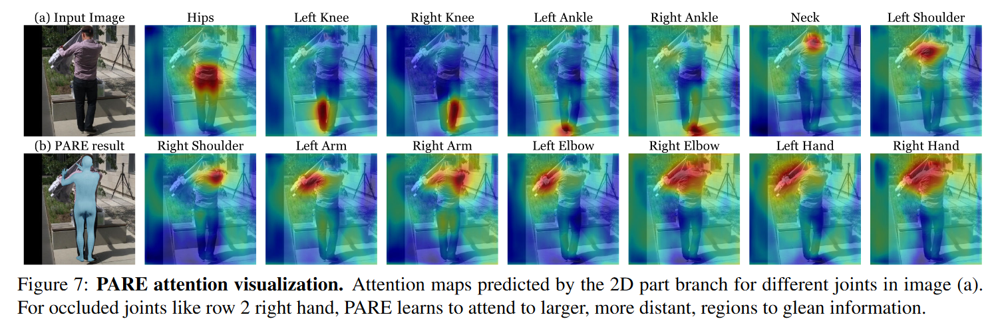

# PARE : Part Attention Regressor for 3 D Human Body Estimation (ICCV 2021)

## 特点
+ 使用 PARE 预测身体各个部位的全图注意力 mask（body-part-guided attention masks），使用身体部位标签（由 mesh 标签特殊处理而来）在训练的前期进行监督，使网络学习到遮挡信息。当对应的身体部位未被遮挡时，身体部位注意力 mask 集中在该部位附近，当身体部位被遮挡时，身体部位注意力 mask 会分散到全身，以此推断被遮挡部位信息，解决了模型当量使用全局特征而导致的当输入哪怕局部被轻微遮挡时导致的 mesh 或关键点预测结果产生巨大的抖动。
+ 本文在针对遮挡方面还使用了 synthetic occlusion，random crop 技术，进行数据增强

## Introduction
+ ***Problem***
	+ SOTA 3 D human pose and shape estimation methods remain sensitive to partial occlusion and can produce dramatically wrong predictions although much of the body is observable.
	+ rely on global feature representations, making them sensitive to even small occlusions.
	尽管众多 SOTA 方法在 3 DHPE 和 3 DHPSE 方面取得了重大进展，但是在身体大部分可见的情况下，一点点的遮挡也会造成很大的误差，本文认为这些方法都过于依赖全局特征。

+ ***PARE***
	It has two tasks: the primary one is learning to regress 3 D body parameters in an end-to-end fashion, and the auxiliary task is learning attention weights per body part. Each task has its own pixel-aligned feature extraction branch.
	两个任务，主要任务是端到端地学习回归 3 D mesh 参数，辅助任务是学习身体部位的注意力权重，每一个任务的特征提取都是像素对齐的。

+ ***body-part-driven attention***
	We supervise the attention mask with part segmentations, but then train end-to-end with pose supervision only, allowing the attention mechanism to leverage all useful information from the body and the surrounding pixels. This gives the network freedom to attend to regions it finds informative in an unsupervised way. As a result, PARE learns to rely on visible parts of the body to improve robustness to occluded parts and overall performance on 3 D pose estimation
	本文在开始阶段通过部分分割来监督注意力掩模，而后仅通过姿势监督进行端到端训练，从而允许注意力机制利用来自身体和周围像素的所有有用信息。这使得网络可以自由地以无人监督的方式关注它发现信息丰富的区域。因此，PARE 学会依靠身体的可见部分来提高对遮挡部分的鲁棒性以及 3 D 姿态估计的整体性能

## CONTRIBUTION
 (1) We apply a visualization technique  to study how local part occlusion can influence global pose; we call this **occlusion sensitivity analysis**.
 (2) This analysis motivates a novel **body-part-driven attention** framework for 3 D HPS regression that leverages **pixel-aligned** localized features to regress body pose and shape.
 (3) The network uses part visibility cues to reason about occluded joints by aggregating features from the attended regions, and by doing so, achieves robustness to occlusions. 
 (4) We achieve **SOTA** results on a 3 D pose estimation benchmark featuring occluded bodies, as well as a standard benchmark.

## Occlusion Sensitivity Analysis
+ Inspared by *Matthew D Zeiler and Rob Fergus. Visualizing and understanding convolutional networks. In European Conference on Computer Vision, 2014.*
+ 目的：分析结果对图像遮挡部位的敏感性
+ 做法：遍历遮挡图像的每一个像素，以该像素为中心生成灰色的图像块遮挡原图内容，根据结果计算该像素对应的误差，跟据每一个像素的结果生成热图。

+ This visualization allows us to make several observations. 
	+ (1) Errors are low in the background and high on the body. This shows that SPIN has learned to attend to meaningful regions.
	+ (2) Joints visible in the original image have high errors when they are occluded by the square, as expected. 
	+ (3) For joints that are naturally occluded, the network relies on other regions to reason about the occluded poses. For example, in the top row of Fig. 2, we observe high errors for the left/right ankles (which are occluded) when we occlude the thigh region. Since the network has no image features for the occluded parts, it must look elsewhere in the image for evidence. 
	+ (4) Such dependencies happen not only between neighboring parts; occlusion can have long-range effects (e.g. occluding the pelvis causes errors in the head).
+ occlusion sensitivity mesh：将以上结果汇聚到一个 SPML 模型上以热图的形式可视化。

## Framework

+ 2 D Part Branch：通道数=J+1 (BG)，在开始阶段使用 [Body part segmentation labels](./attachment/PAREBodyPart20230821141324.png) 进行监督，在[一定训练步数](./attachment/Result20230821142204.png)后不再进行监督
+ 3 D Body Branch：通道数 C
+ 两者的特征图尺寸大小相同，保持一致性
+ 取得的结果进行 Hadamard 积，实际使用 P 软注意力 mask 与 F 的特征进行了特征聚合

### Body part segmentation labels

+ The part segmentation labels are obtained through rendering segmented SMPL meshes, as visualized in Fig. 4. We use 24 parts corresponding to 24 SMPL joints. See Sup. Mat. for samples of part segmentation labels. We used the PyTorch reimplementation of Neural Mesh Renderer to render the parts. For samples without a part segmentation label, we do not supervise the 2 D branch.
	通过绘制分割后的 SMPL 网格获得部位分割标签，如图所示。我们使用24个部位对应24个 SMPL 接头。我们使用 PyTorch 重新实现的神经网格渲染器来渲染部件。对于没有零件分割标签的样品，我们不监督二维分支。

### Train

+ synthetic occlusion
+ random crop
+ extract data 

### Result

