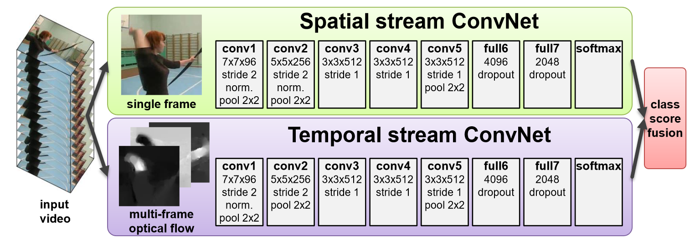
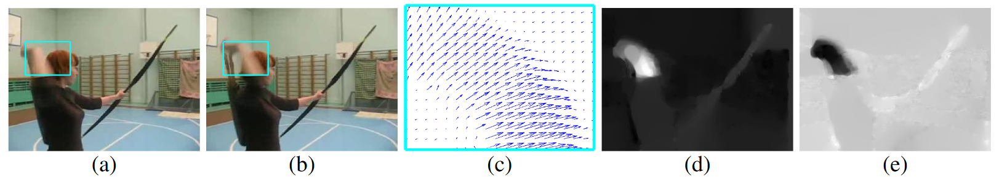
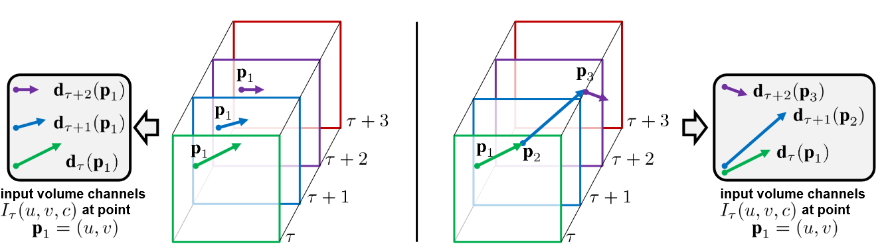

## FrameWork

+ 两路并行，最终分别输出softmax，经过融合层输出最终分类结果
+ 两种融合的方法：
	1. 平均
	2. 训练一个多类别 SVM, 以堆叠的 L2 Norm softmax 分数为特征 (√)

### Spatial Stream Convnet
空间卷积网络本质上是一个图像分类架构，在大规模图像识别方法的最新进展的基础上，在大型图像分类数据集上对网络进行预训练，如 ImageNet Challenge 数据集。

### Optical flow ConvNets
输入为连续帧光流 (optical flow)位移场

+ (a)(b)：连续视频帧，矩形框框出了运动部分的位置
+ (c)：矩形框对应的密集光流区域特写
+ (d)(e)：位移向量场的水平分量 $d^x$ 和垂直分量 $d^y$

#### 光流叠加 Optical flow stacking
+ 将图像的光流位移场的水平分量和垂直分量作为图像的两个通道输入
	+ 对于 $L$ 帧的输入视频序列，将会得到 $2L$ 的输入序列
	+ 对于任意帧 $\tau$ ，其网络的输入见下式(1)(2)
	+ 对于任意点 $point(u,v)$， $I(u,v,c)$ 其中 $c=[1:2L]$ 编码了该点的所有动作信息

$$
\begin{align}
I(u,v,2k-1)=d^x_{\tau+k-1}(u,v),\tag{1} \\
I(u,v,2k)=d^y_{\tau+k-1}(u,v),\tag{2}  \\
\text{u=[1:w], v=[1:h], k=[1:L]}  
\end{align}
$$

#### 轨迹叠加 Trajectory stacking.
+ 一个可选的运动表示
+ 受基于轨迹描述的启发，用流沿着运动轨迹，跨多帧针对相同点进行采样
+ 对于任意帧 $\tau$ ，其网络的输入为：

$$
\begin{align} \\
I(u,v,2k-1)=d^x_{\tau+k-1}(p_{k}),\tag{1} \\
I(u,v,2k)=d^y_{\tau+k-1}(p_{k}),\tag{2} \\ \\ 
\text{u=[1:w], v=[1:h], k=[1:L]} 
\end{align}
$$
  
+ $p_{k}$ 是轨迹上的第 k 个点，开始位置在第 $\tau$ 帧的 $(u,v)$ 位置，对应关系如下：

$$
\begin{align}
p_{1}&=(u,v) \\
p_{k}&=p_{k-1}+d_{\tau+k-2}(p_{k-1}),k>1
\end{align}
$$

### Mean Flow Subtraction
+ 对网络输入进行归零（zero-centering）通常是有益的，因为它允许模型更好地利用非线性整流函数（非线性激活函数）
+ 针对光流输入需要减去全局运动分量
+ 本文在每一个位移场d中都减去它的均值矢量
